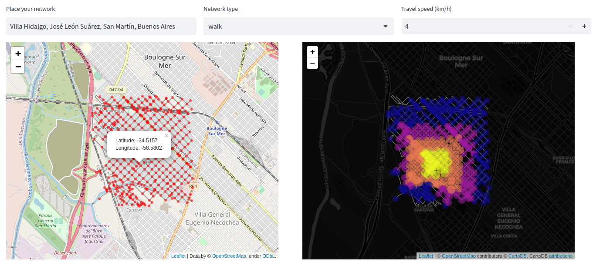

# urban_connector
Tools for street networks modeling 
> This repository compiles a set of strategies to build transit networks and perform connectivity assesments.  

**Connectivity patterns**

Pick a reference point, decide the buffer distance from it and estimate connectivity metrics for different network types

**Accessibility patterns**

Enter the place name of your network, click a reference node and calculate travel time isochrones for different transit networks
