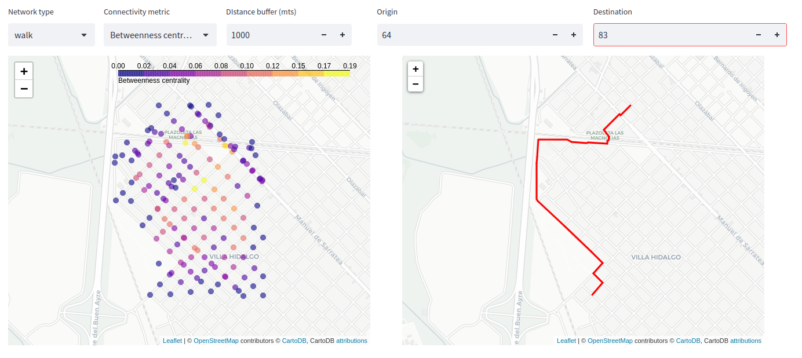

# urban_connector
Tools for street networks modeling 
> This repository compiles a set of strategies to build transit networks and perform connectivity assesments.  

Connectivity patterns

Accessibility patterns

